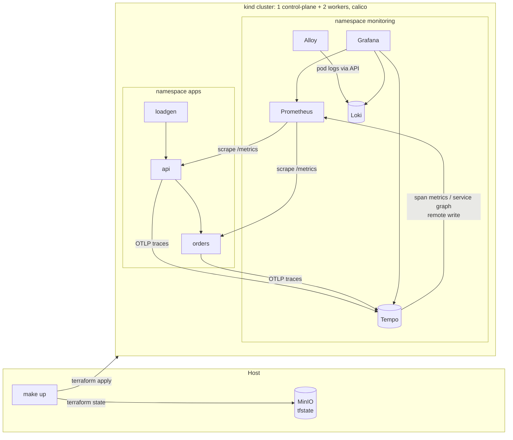
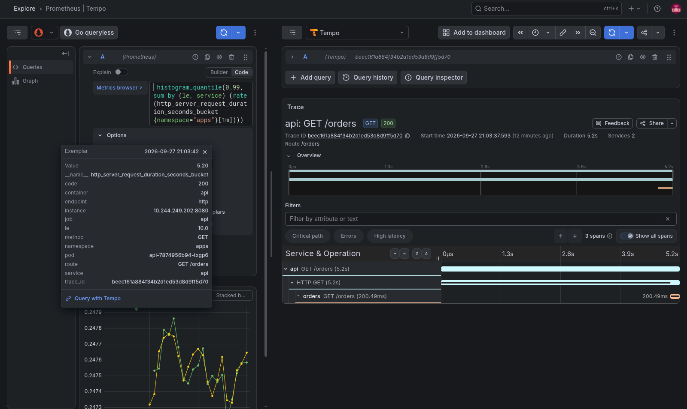

# Teachy - Infrastructure Technical Challenge - Kubernetes & Observability

A local Kubernetes cluster (kind) with a full observability stack (metrics, 
logs and traces), and two small Go services that emit all three signals
correlated by `trace_id`. 

## Architecture



| Signal | Path |
|---|---|
| Metrics | Prometheus scrapes `/metrics` via a ServiceMonitor (histogram with exemplars) |
| Traces | Services send OTLP straight to Tempo |
| Logs | Services log JSON to stdout, Alloy reads pod logs through the API and pushes to Loki |

## Prerequisites

- GNU Make (v4.4)
- OpenSSL 3
- Docker 29 (with Compose v2)
- OpenTofu 1.10+ (or Terraform 1.10+, running `make up TF=terraform`)
- kind 0.30+ (only the CLI, used to load the images into the nodes)
- kubectl

## Running

```sh
make up
```

On the first run it:

- generates `.env` with a random MinIO password (if it doesn't exist).
  - MinIO console: http://localhost:9001 (credentials in `.env`).
- starts MinIO and creates the `tfstate` bucket (remote state with locking).
- `stack/cluster`: creates the kind cluster, Calico and metrics-server.
- `stack/platform`: installs kube-prometheus-stack, Loki, Tempo and Alloy.
- builds the service images, loads them into kind, and applies `stack/apps`.

> It takes about 5 minutes when the container images are already cached locally.
The first run on a new machine takes longer, since most of the time goes into
pulling images.

```sh
# Destroys everything in reverse order, including the MinIO volume
make down
```

## Exploring

```sh
kubectl --kubeconfig kubeconfig -n monitoring port-forward svc/kube-prometheus-stack-grafana 3000:80
kubectl --kubeconfig kubeconfig -n monitoring get secret kube-prometheus-stack-grafana \
  -o jsonpath='{.data.admin-password}' | base64 -d
```

Open http://localhost:3000 (user `admin`). The load generator is already sending
~5 req/s, and `orders` fails 5% of the requests on purpose.


 
## Repository layout

```
bootstrap/       compose file for MinIO (remote state)
stack/cluster/   kind cluster, Calico, metrics-server
stack/platform/  kube-prometheus-stack, Loki, Tempo, Alloy, and values
stack/apps/      deployments, services, ServiceMonitor, load generator
services/        Go module with the api and orders services
Makefile         entrypoint, orders the stacks
```

## Decisions

### Stacks
The cluster, the platform and the apps are separate terraform roots, each with
its own state in MinIO. If I break a Helm value, the cluster isn't touched,
and I can tear down and recreate one layer without the others. MinIO runs in
Docker Compose, outside the cluster, since the state can't live inside the
thing it creates. It's the same S3 backend I'd use in AWS, just local.

### Calico
Kindnet doesn't enforce NetworkPolicy, Calico does. I had to change the pod CIDR
to `10.244.0.0/16`, because Calico's default (`192.168.0.0/16`) overlapped with
the kind Docker network and pods on the workers were unreachable.

### Loki and Tempo as single binaries
The distributed modes need object storage and a bunch of components, which is
overkill here. Both write to a PVC (kind's local-path provisioner), so data
survives a pod restart.

### Alloy only for logs.
It runs as a single Deployment and reads pod logs through the Kubernetes API,
the same way `kubectl logs` does. No hostPath, no privileged pods. On a bigger
cluster I'd switch to a DaemonSet reading from the node disk, to keep the load
off the API server. Traces go straight from the services to Tempo, and 
Prometheus scrapes the metrics, so Alloy isn't in the middle of those.

### Correlation lives in the Grafana datasources
They have fixed uids and point to each other: Prometheus exemplars open the
trace in Tempo, Tempo opens the logs in Loki by `trace_id`, and Loki turns the
`trace_id` in the log line into a link back to Tempo.

### Services 
Just two small Go services. It's enough to get a real distributed trace, an 
edge in the service graph and context propagation.

- traces: OpenTelemetry SDK with `otelhttp` on the server and the client (W3C `traceparent`);
- metrics: Prometheus client, latency histogram with the `trace_id` as exemplar;
- logs: `slog` JSON, with a small handler that adds `trace_id` and `span_id`.

### No registry 
Images are built locally and loaded into the nodes with `kind load`, so `make up`
works on a fresh clone with nothing else. The tag is the short commit SHA, so a
new commit means a new rollout. Images are distroless and run as non-root.

### Pods 
Each container asks for a small amount of CPU and memory (requests), so the
scheduler knows where it fits. Memory has a hard limit, so a leak kills the
container instead of the node. CPU has no limit on purpose: a CPU limit makes
the kernel throttle the app, which shows up as extra latency.

The containers also run as a non-root user.

## What was left out and why

With the deadline, I focused on getting the required scope working end to end
instead of starting extras I couldn't finish.

What I'd do next:

### Alerts
Right now you have to open Grafana to see that `orders` is failing. I'd add
Prometheus alerts for error rate and latency on the `api`, sending to 
Alertmanager.

### NetworkPolicies
Calico is already installed for this, but no policy is applied yet. I'd block
everything in `apps` by default and allow only `loadgen → api → orders`, 
Prometheus scraping and traces going to Tempo.

### Grafana dashboard for the services
Requests, errors and latency per service saved in the repo instead of built
by hand.

### Timeout on the `api` HTTP client
Today, if `orders` hangs, the request in `api` hangs with it. The screenshot
above shows a 5s request caused by this.

### CI
To build the images and run `fmt`/`validate` and `go vet` on every push.

### Service mesh (Istio) for mTLS between services.
I left it out because it adds a lot of moving parts to a local cluster.
